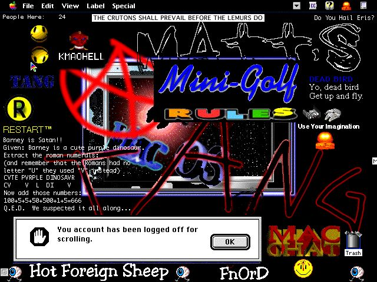

# Mac Hells

In the Mac AOL underground, hacking tools were called **"hells"** — the Mac equivalent of Windows "proggies." These included macro-based tools (KeyQuencer, OneClick, and RzaHell), 68k binary patchers, and other tools that exploited AOL's FDO protocol, client-trusted billing, and other design flaws in the Mac AOL client.

All hells below were extracted from the **[WhackedMac Archives Version 1.0](https://archive.org/details/the-whacked-mac-archives-version-1.0-l-0-pht-heavy-industries-inc.-1996)** CD-ROM (L0pht Heavy Industries, November 1995), path: `Pub/AOLCrap/`.

## Hells

| Hell | Author | Year | Type | Description |
|------|--------|------|------|-------------|
| [AOL4Free v4](hells/aol4free/) | Happy Hardcore | 1995 | 68k binary patcher | Exploited client-trusted billing to access all paid services for free. Includes the original .sit archive, full 68k disassembly, 9 architecture diagrams, FDO protocol docs, and Happy Hardcore's own writings. |
| [AOLAid 2.5](hells/aolaid/) | Unknown | 1995 | System extension (INIT) | Lets you download and chat at the same time on AOL 2.1. Drop onto System Folder and restart. |
| [Lith-O-Hell](hells/lithohell/) | Unknown | 1995 | KeyQuencer macros | 13 sequences: IM bomb, mail bomb, mass mail, PR squeeze, turn IMs on/off, and more. Includes keyset and documentation. |
| [MAOHELL b2](hells/maohell/) | ηeη | 1995 | KeyQuencer macros | "AOHELL for Mac" — mail bomb, IM bomb, scroll hell, hell drive scan (crashes PC A: drives via chat), credit card generator, AOL Aid. 9 sequences. |
| [NAPOhell v1.0](hells/napohell/) | mike | 1995 | KeyQuencer control panel (cdev) | Control panel-based hell with macros. Promised AOPHree 1.0 ("just like AOL4Free only better") in a future release. |
| [No Dice](hells/nodice/) | Andrew Welch / Ambrosia Software | 1995 | System extension (INIT) + C source | Automatically ignores dice rolls in AOL chat rooms by patching `_TEDispatch`. Full C source code included — patches the Toolbox trap to filter "OnlineHost" messages in "People Connection" windows. |
| [SLAYoHell v1.2](hells/slyohell/) | Unknown | 1995 | KeyQuencer macros + plug-ins | Full hell suite: 55 KeyQuencer plug-ins, ASCII art collection (14 pieces), gPaste, No Dice, documentation. Bundled with BBEdit Lite 3.0. |

## Screenshots of Hells

*Screenshots courtesy of iconidentify.*

### PB (November 2, 1997)

### Sven (April 3, 1996)

### Tang (April 13, 1996)

