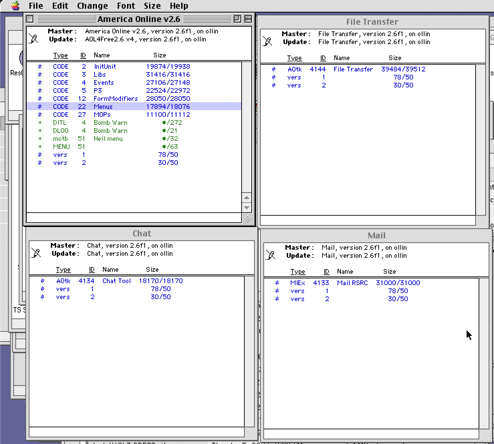
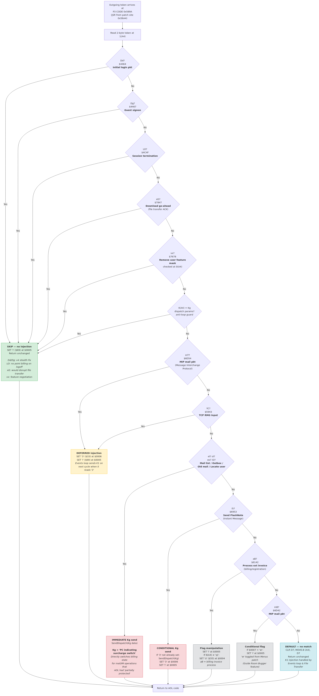
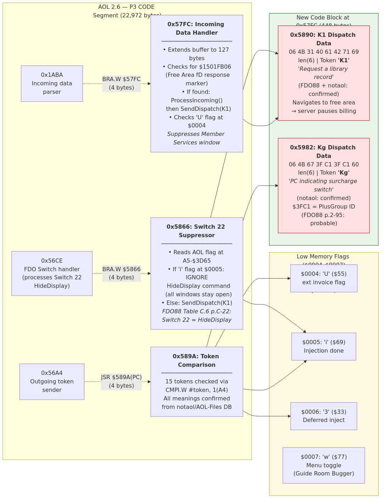
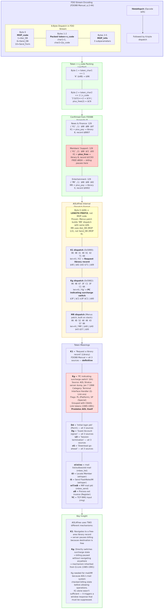

# AOL4Free v4 — Mac Binary Patcher (1995)

AOL4Free was a binary patcher for the Macintosh AOL 2.5/2.6 client, written by Nicholas Ryan (Happy Hardcore) and released June–September 1995. It allowed users to access all of AOL's paid services — chat, email, file downloads, web browsing — without being charged the $3/hour usage fee by exploiting a design flaw in AOL's client-trusted billing system.

v4 (September 13, 1995) was the "stealth" release that evaded AOL's `CMis` detection by no longer injecting a free-area token during the login sequence.

## Download

[AOL4FREE2.6v4.sit](AOL4FREE2.6v4/AOL4FREE2.6v4.sit) — Original StuffIt archive (70KB), from the WhackedMac Archives CD (L0pht Heavy Industries, 1995)

## Analysis Documents

| Document | Description |
|----------|-------------|
| [AOL4Free2.6_v4_readme.txt](AOL4FREE2.6v4/AOL4Free2.6_v4_readme.txt) | Happy Hardcore's original v4 readme distributed with the software — how it works, version history, known issues |
| [happy_hardcore_essay_after_getting_caught.txt](AOL4FREE2.6v4/happy_hardcore_essay_after_getting_caught.txt) | Happy Hardcore's 30KB first-person essay written after being caught — the full story from his perspective |
| [AOL4FREE-Technical-Analysis.md](AOL4FREE-Technical-Analysis.md) | High-level explanation of how AOL4Free worked, how AOL detected it, and the v4 stealth fix |
| [AOL4FREE-Binary-Analysis.md](AOL4FREE-Binary-Analysis.md) | Full 68k disassembly of the v4 patch code — token dispatch table, injection mechanisms, flag system |
| [HOW-TO-DECOMPILE.md](HOW-TO-DECOMPILE.md) | How to extract and disassemble classic Mac resource fork binaries on Linux using unar + Capstone |
| [FDO88 Manual (PDF)](FDO88_Manual_v1_1994-01_(searchable).pdf) | AOL's internal Form Definition Opcode reference (January 1994, 239 pages) — the protocol spec AOL4Free exploited |
| [AOL 2.6b15 FDO Version Analysis](../aol26-client/AOL26-FDO-Version-Analysis.md) | Binary proof that AOL 2.6 uses FDO88 — CODE segment names, dispatch format, Kg token in unpatched client, error strings |
| [Token → FDO Source Mapping](AOL4FREE-Token-FDO-Mapping.md) | Every token in the AOL4Free patch mapped to its authoritative source with exact page numbers |

## Reference Materials

| Directory | Contents |
|-----------|----------|
| [fdo91_docs/](fdo91_docs/) | FDO91 protocol documentation — text and PDF versions of the Host Forms Server, Action Protocol, Async, Chat, File Transfer, and other chapters |
| [resources/](resources/) | Extracted CODE resources (68k machine code segments) from the AOL 2.6 client — 54 CODE segments used for cross-referencing the patch sites |
| [AOL4FREE2.6v4/](AOL4FREE2.6v4/) | Extracted contents of the .sit archive — patcher binary, uninstaller, docs, and mailbomber macro |

## Screenshots

*Screenshots by [atax1a](https://github.com/atax1a) — disassembly in Ghidra/ResEdit showing the patch structure.*

### AOL v2.6 Patched with AOL4Free

### P3 Resource Patch

### Unconditional Jump to Patch Block

### What Happy Hardcore May Have Seen When Making the Patcher

## Architecture Diagrams

### 1. Normal vs Patched Token Flow

How the patched client injects K1(free) after outgoing tokens compared to the normal client.

### 2. v4 Stealth Signon

The one-line fix that defeated AOL's CMis detection — skip K1 injection after the Dd login token.

### 3. Token Dispatch Table

The hardcoded token comparison table at `0x589A` — which tokens get skipped, deferred, or injected with K1 vs Kg.

### 4. Patch Architecture

The four patch sites in the P3 CODE segment and how they redirect into the 448-byte code block.

### 5. Three Injection Mechanisms

Token dispatch hook, event loop handler, and file transfer handler — the three paths that inject free-area tokens.

### 6. AOL Protocol Exploit

The design flaw: HideDisplay was a client-side request, not a server-enforced command. The server never verified compliance.

### 7. Version History & Detection

Timeline from Beta 1 through v4, showing AOL's detection efforts and Happy Hardcore's countermeasures.

### 8. Memory Map

The low-memory flag system at `$0004`–`$0007` (68k reset vector area) used to coordinate injection state.

### 9. FDO88 Dispatch Encoding

How the 6-byte dispatch structure encodes MOP code, packed token+surcharge, and parameters.

